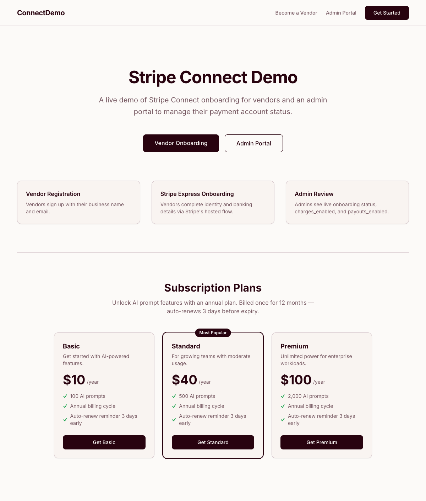

# Stripe Connect Demo

A demo application showing Stripe Connect vendor onboarding and an admin review portal, built with FastAPI + Next.js and deployable to Railway.



## What it does

- **Vendor onboarding** — vendors register with their business name and email, then complete Stripe's hosted Express account onboarding (identity, bank account, etc.)
- **Webhook sync** — Stripe sends `account.updated` events that automatically update each vendor's onboarding status
- **Admin portal** — admins view all vendors, their Stripe account status (`charges_enabled`, `payouts_enabled`), and can manually trigger a status sync

## Tech stack

| Layer | Technology |
|---|---|
| Backend API | Python 3.12, FastAPI, SQLAlchemy 2, Alembic |
| Async worker | Celery 5, Redis |
| Database | PostgreSQL |
| Frontend | Next.js 14 (App Router), TypeScript, Tailwind CSS |
| Payments | Stripe Connect (Express accounts) |
| Deployment | Railway (multi-service) |

---

## Local Development

### Prerequisites

- Python 3.12
- Node.js 20+
- PostgreSQL (running locally)
- Redis (running locally)
- [Stripe CLI](https://stripe.com/docs/stripe-cli) — for webhook forwarding
- A [Stripe test account](https://dashboard.stripe.com)

### 1. Clone and configure

```bash
git clone git@github.com:partwith/stripe-connect-demo.git
cd stripe-connect-demo
cp .env.example .env
```

Edit `.env` with your values:

```env
# Get from https://dashboard.stripe.com/test/apikeys
STRIPE_SECRET_KEY=sk_test_...
STRIPE_PUBLISHABLE_KEY=pk_test_...

# Filled in step 4 after running stripe listen
STRIPE_WEBHOOK_SECRET=whsec_...

# PostgreSQL — create database first: createdb stripe_demo
DATABASE_URL=postgresql://youruser@localhost:5432/stripe_demo

# Redis
REDIS_URL=redis://localhost:6379/0

# App
FRONTEND_URL=http://localhost:3000
ADMIN_API_KEY=demo-admin-key-change-me
```

### 2. Backend setup

```bash
cd backend
python3.12 -m venv .venv
source .venv/bin/activate
pip install -r requirements.txt
```

Create the database and run migrations:

```bash
createdb stripe_demo   # or via psql
alembic upgrade head
```

### 3. Start the Stripe webhook listener

In a dedicated terminal (keep it running):

```bash
stripe listen \
  --api-key sk_test_... \
  --forward-to localhost:8000/api/webhooks/stripe
```

Copy the `whsec_...` signing secret it prints and paste it into `.env` as `STRIPE_WEBHOOK_SECRET`.

### 4. Start the backend

```bash
cd backend
source .venv/bin/activate
uvicorn app.main:app --reload --port 8000
```

Verify: `curl http://localhost:8000/health` → `{"status":"ok"}`

### 5. Start the frontend

```bash
cd frontend
npm install
NEXT_PUBLIC_API_URL=http://localhost:8000 \
NEXT_PUBLIC_ADMIN_KEY=demo-admin-key-change-me \
npm run dev
```

Open **http://localhost:3000**.

### 6. (Optional) Start the Celery worker

The worker periodically syncs all non-complete vendor statuses from Stripe (every 5 minutes). Not required for basic testing — the webhook listener handles real-time updates.

```bash
cd backend
source .venv/bin/activate
celery -A celery_worker.celery_app worker --loglevel=info
```

---

## Usage

### Vendor onboarding flow

1. Go to **http://localhost:3000/vendor/register**
2. Enter a business name and email
3. Click **Continue to Stripe Onboarding** — you're redirected to Stripe's hosted flow
4. Complete onboarding using [Stripe test data](https://stripe.com/docs/connect/testing) (no real info needed)
5. After completing, you're returned to the app with your status

For Stripe test onboarding, use:
- Routing number: `110000000`
- Account number: `000123456789`
- Any future date for DOB
- ABN (Australian Business Number): `51824753556` (or `83914571673`)

Stripe validates ABN format in test mode but does not verify against the ABR, so any valid-format ABN works.

### Admin portal

Go to **http://localhost:3000/admin**

- See all vendors with their onboarding status
- Click any vendor to view full Stripe account details
- Click **Sync Stripe Status** to pull the latest data from Stripe on demand

Admin API key defaults to `demo-admin-key-change-me` (set via `ADMIN_API_KEY` env var).

---

## API reference

All endpoints are served from the FastAPI backend (`http://localhost:8000`).

### Vendor endpoints

| Method | Path | Description |
|---|---|---|
| `POST` | `/api/vendors/` | Register a new vendor + create Stripe Express account |
| `POST` | `/api/vendors/{id}/onboard` | Generate a Stripe account link URL |
| `GET` | `/api/vendors/{id}` | Get vendor status |

### Admin endpoints (requires `X-Admin-Key` header)

| Method | Path | Description |
|---|---|---|
| `GET` | `/api/admin/vendors` | List all vendors |
| `GET` | `/api/admin/vendors/{id}` | Get vendor detail |
| `POST` | `/api/admin/vendors/{id}/sync` | Pull latest status from Stripe |

### Webhooks

| Method | Path | Description |
|---|---|---|
| `POST` | `/api/webhooks/stripe` | Stripe webhook receiver (`account.updated`) |

---

## Running tests

```bash
cd backend
source .venv/bin/activate

DATABASE_URL=postgresql://youruser@localhost:5432/stripe_demo \
STRIPE_SECRET_KEY=sk_test_placeholder \
STRIPE_WEBHOOK_SECRET=whsec_placeholder \
ADMIN_API_KEY=demo-admin-key-change-me \
pytest tests/ -v
```

22 tests covering vendor registration, onboarding, admin API, webhook handling, and Stripe service layer.

---

## Deployment (Railway)

See [RAILWAY_SETUP.md](RAILWAY_SETUP.md) for the full step-by-step guide.

**TL;DR:**

1. Push this repo to GitHub
2. Create a Railway project → deploy from GitHub
3. Add PostgreSQL and Redis plugins
4. Set environment variables on each service
5. Run `railway run --service api alembic upgrade head`
6. Register the webhook endpoint in the Stripe dashboard

---

## Project structure

```
stripe-connect-demo/
├── backend/
│   ├── app/
│   │   ├── main.py           # FastAPI app
│   │   ├── config.py         # Environment config
│   │   ├── database.py       # SQLAlchemy setup
│   │   ├── models/           # Vendor model
│   │   ├── schemas/          # Pydantic schemas
│   │   ├── routers/          # vendor, admin, webhook
│   │   ├── services/         # Stripe SDK wrapper
│   │   └── tasks/            # Celery tasks
│   ├── celery_worker.py
│   ├── alembic/              # Database migrations
│   └── requirements.txt
├── frontend/
│   └── src/
│       ├── app/              # Next.js pages
│       │   ├── page.tsx              # Landing
│       │   ├── vendor/register/      # Vendor registration
│       │   ├── return/               # Post-Stripe return
│       │   └── admin/                # Admin portal
│       ├── components/       # Nav, StatusBadge, VendorCard
│       └── lib/              # API client, TypeScript types
├── railway.toml              # Railway deployment config
└── RAILWAY_SETUP.md          # Deployment guide
```
